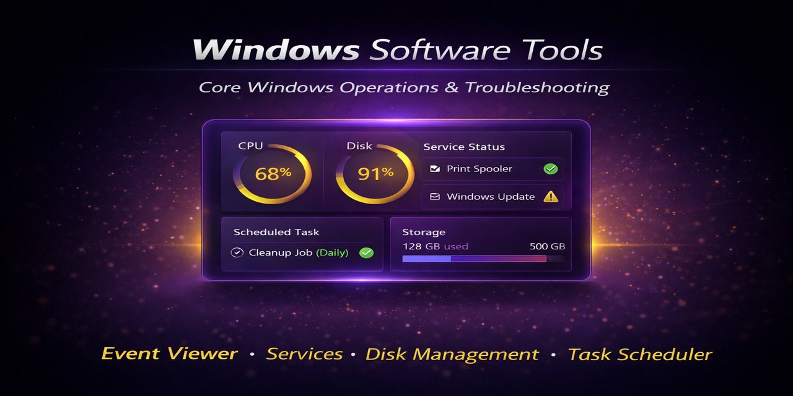
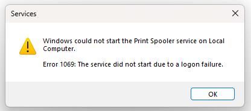
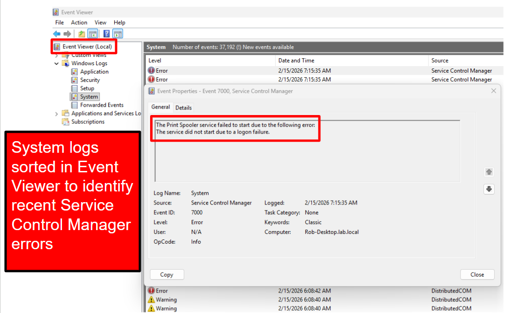
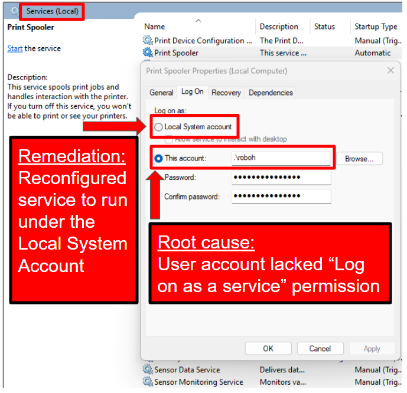
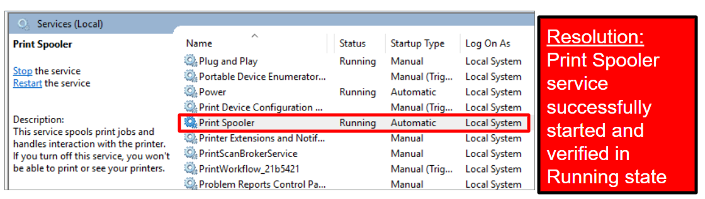
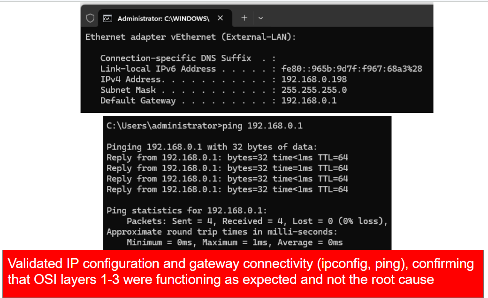

## Operational Relevance

This project demonstrates foundational skills using Windows software tools. Proficiency with Tier-1 and Tier-2 IT Support tasks is demonstrated with screenshots ( click the > dropdowns to view ). Troubleshooting activities are supplemented with ITSM-style tickets which are documented in a companion repository.

(see: [Troubleshooting Journal](https://github.com/robohlstrom24/troubleshooting-journal))

## Tier-1 Job Duties

  
 Troubleshooting High CPU Usage (Task Manager / Performance Monitor / Task Scheduler)

  **Scenario: A background automation script becomes stuck in a continuous loop while parsing log data, causing high CPU utilization.** 

  hook1.png)
  ___________________________________
  system-saturated.png)
  _____________________________________________
  event-viewer2.png)
  ______________________________________________
  
  ____________________________________________
  PowerShell-stop.png)
  _____________________________________________
  baseline-restored.png)

  **Lessons Leanred:**
  
- High CPU investigations should begin by identifying the top resource-consuming process before taking action
- Performance Monitor helps confirm whether resource spikes are sustained system issues versus temporary application activity
- Investigating automation sources is critical before terminating processes to avoid interrupting legitimate workloads

 See ITSM-style troubleshooting ticket T-0013 in [Troubleshooting Journal](https://github.com/robohlstrom24/troubleshooting-journal)

  
 Troubleshooting printer failure (Event Viewer / Services) 

The issue:

 
 _______________________________

Troubleshooting Steps:

 
 _________________________________

 
 ______________________________

Resolution:

 

 See ITSM-style troubleshooting ticket T-0009 in [Troubleshooting Journal](https://github.com/robohlstrom24/troubleshooting-journal)
 

## Tier 2 Job Duties

  
Troubleshooting an Unavailable Web Application (netstat, Services Manager)

  **Scenario: An internal web application becomes unavailable after the web service hosting the site stops running on the server**

  .png)
  ______________________________________________________
  
  _____________________________________________________
  none-listening.png)
  _____________________________________________________
  service-not-running.png)
  ___________________________________________________
  service-restarted.png)
  ___________________________________________________________
  port-listening.png)

**Lessons Learned:**
- Verifying whether a service port is listening is a quick way to determine if an application is accepting connections
- Network tools like netstat can help distinguish between connectivity issues and application/service failures
- Understanding which services support critical applications helps speed up root cause identification

   See ITSM-style troubleshooting ticket T-0014 in [Troubleshooting Journal](https://github.com/robohlstrom24/troubleshooting-journal)

